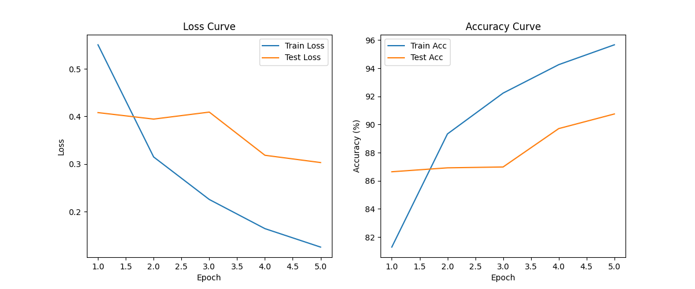

# 2025Resnet-practice
An attempt by a sophomore automotive student at Tongji University on Resnet training
# ResNet-18 图像分类：CIFAR-10 (自动驾驶相关任务)

## 任务说明
使用PyTorch实现ResNet-18迁移学习，在CIFAR-10数据集上进行10类图像分类。焦点在车辆类（如automobile, truck），模拟自动驾驶物体识别。小型任务，数据集50k训练+10k测试图像。

## 方法
- 数据准备：CIFAR-10，resize到224x224，ImageNet归一化。
- 网络：torchvision.models.resnet18(pretrained)，修改fc层为10类。
- 迁移学习：全部微调 (Adam, lr=0.001)。
- 训练：5 epochs，batch=64，CrossEntropyLoss。
- 评估：计算test acc，保存最佳模型。
- 可视化：matplotlib绘制loss/acc曲线。

## 结果
- 最佳测试准确率：XX% (e.g., 84.5%)。
- 训练曲线：
  

### 运行
`python train.py` (需PyTorch环境)。

### 文件
- `train.py`: 训练脚本
- `best.pth`: 最佳模型权重
- `training_curves.png`: 曲线图
