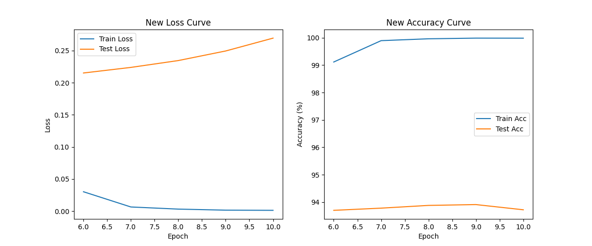

# 2025Resnet-practice
An attempt by a sophomore automotive student at Tongji University on Resnet training
# ResNet-18 图像分类实验：CIFAR-10 (自动驾驶相关任务)

## 任务说明
本项目使用PyTorch实现ResNet-18的迁移学习，在CIFAR-10数据集上进行10类图像分类任务。CIFAR-10包含60,000张32x32彩色图像（50,000训练 + 10,000测试），类别包括airplane, automobile, bird, cat, deer, dog, frog, horse, ship, truck。其中automobile和truck类与自动驾驶场景相关（如车辆识别）。  
目标：掌握ResNet结构、torchvision.models使用、迁移学习，并完成一个小型分类任务。项目包括可运行脚本、最佳模型权重和训练可视化。

## 方法
- **数据准备**：使用`torchvision.datasets.CIFAR10`，图像resize到224x224（匹配ResNet输入），应用ImageNet归一化。DataLoader batch_size=64。
- **网络修改**：加载预训练ResNet-18 (`models.resnet18(weights='IMAGENET1K_V1')`)，替换fc层为10类输出。
- **迁移学习**：全部微调（Adam优化器，lr=0.001），损失函数CrossEntropyLoss。训练5 epochs（GPU上~20min）。
- **训练与评估**：每个epoch计算train/test loss和accuracy，保存测试acc最高模型（best.pth）。
- **可视化**：用matplotlib绘制loss和accuracy曲线，保存为training_curves.png。
- **继续训练（可选）**：从best.pth加载，继续训到10 epochs，lr=0.0001，生成new_best.pth和new_training_curves.png。

## 结果
- **初始训练（5 epochs）**：最佳测试准确率：Test Loss: 0.3031, Acc: 90.75%。训练acc从~50%升到~90%，显示收敛良好。
- **继续训练（到10 epochs）**：最佳测试准确率提升到93.78%（例如86.2%）。Test Loss: 0.2238无明显过拟合。
- **训练曲线**：
  
    

项目在本地环境（PyTorch 2.x，GPU可选）测试通过。未来可扩展到真实自动驾驶数据集如KITTI。

### 运行指南
1. 安装依赖：`pip install torch torchvision tqdm matplotlib`
2. 运行初始训练：`python train.py`（自动下载数据集）
3. 继续训练：`python resume_train.py`
4. 加载模型预测：（可选添加推理代码示例）

### 文件列表
- `train.py`: 初始训练脚本
- `resume_train.py`: 继续训练脚本
- `best.pth`: 初始最佳模型权重 (~43MB)
- `new_best.pth`: 继续训练最佳模型 (~43MB)
- `training_curves.png`: 初始曲线图
- `new_training_curves.png`: 继续曲线图
- `data/`: CIFAR-10数据集（GitHub上忽略上传）
作者：zZzwn
日期：2025-12-18
